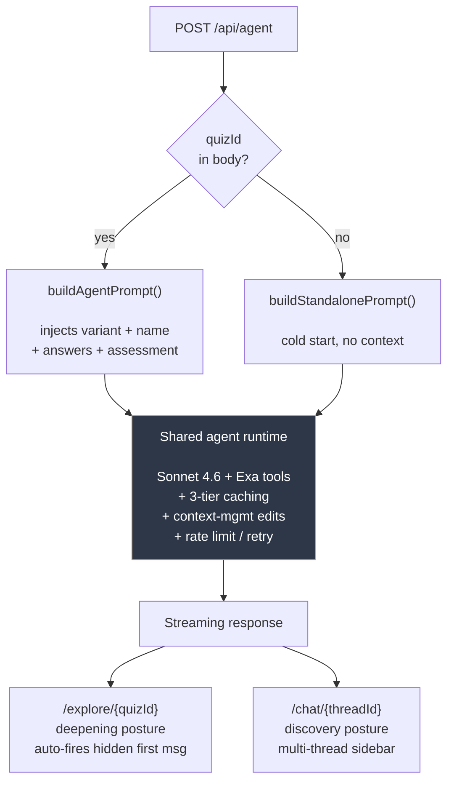
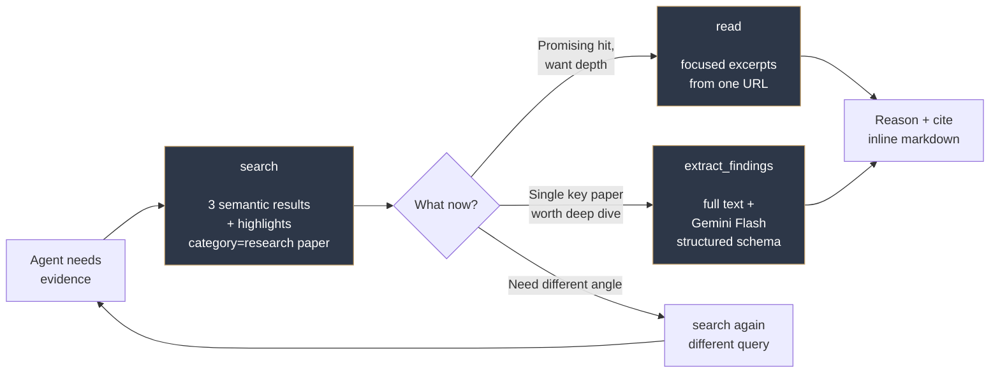

# Prism Quiz

A config-driven health assessment platform built for [Prism Health](https://prism.miami). Users complete a brief structured intake, an LLM agent generates an evidence-cited assessment grounded in Prism's bioenergetic framework, and the conversation can continue as a multi-turn agent chat. Three audience pillars share a single engine; for the full reference see [`docs/architecture.md`](./docs/architecture.md).

---

## The design challenge

The product bet: in a market crowded with low-evidence content, the most powerful conversion mechanism is genuine, evidence-cited, deeply personalized expert reasoning. *Value-as-conversion*, not value-then-conversion. The engineering challenge that creates: produce that depth at scale, across audiences with very different patience and intent profiles, without burning unit economics or forking the codebase. The five load-bearing decisions I built around:

- **The agent *is* the consultation, not a chatbot pointing at one.** Deliberate dual-job system prompt (bioenergetic expert *and* personalized contextualizer of services) that only surfaces booking when the user asks. Genuine expertise is what's offered; conversion is a side effect.
- **One engine, audience-stratified postures.** Cold (paid ads), warm (already in the brand's orbit), and B2B partner all run through the same pipeline. Question count, tone, tool budget, and CTA strength vary as config, not as forks. The engine compounds instead of fragmenting.
- **Config-driven leverage.** One `VariantConfig` per variant propagates to ~10 destinations (Zod schema, prompts, wizard state, UI dispatch, SEO, admin, PDF). Adding a variant is a config edit. Best-life-care (a structurally different 38-question B2B intake) shipped with a `getStorage(variant)` branch and a few small server modules; the rest is a single config file.
- **Three-tier prompt caching.** A 21K-token system prompt × up to 10 agentic steps would be prohibitively expensive without it. Anthropic ephemeral caching across tool schemas, system prompt, and history breakpoints (applied via [`cacheManager.ts`](./app/api/agent/lib/cacheManager.ts)) achieves a measured **95.3% hit rate, ~73% cost reduction**. Without this the depth that defines the product would have had to be cut.
- **Exa as evidence layer.** A semantic knowledge layer purpose-built for LLM agents, returning cleaned highlights in the shape an agent's reasoning loop actually needs. The system prompt's fabrication guard enforces real-or-no citations. This is what makes the evidence-based positioning defensible at runtime, not just at the marketing layer.

These decisions reinforce each other rather than just sit alongside. Pull any one out and the strategy collapses.

---

## The three pillars

The same core engine (Next.js routes, prompt scaffolding, Exa tools, three-tier caching) serves three distinct audiences with three distinct strategies:

| Pillar | Route | Audience | Storage |
|---|---|---|---|
| **Standard quizzes** | `/quiz/{variant}` (12 variants) | Warm, already in Prism's orbit | `quiz-*` (Upstash) |
| **Cold-traffic assessment** | `/assessment` | Cold, first touch from paid ads | `assessment-*` (separate Redis DB) |
| **Best-life-care intake** | `/quiz/best-life-care` (hidden) | B2B partner client base | `bestlife-*` (same Redis, isolated keys) |

### Standard quizzes

Twelve condition-specific variants (root-cause, gut, fatigue, hormones-women, testosterone, sleep, thyroid, brain-fog, weight, skin, anxiety, allergies) for users who already know Prism, typically through founder Dalton's "Analyze and Optimize" content. The audience can absorb depth: an 11-question intake produces a research-cited assessment, then optionally hands off to a follow-up chat that doubles as a personalized consultation. The agent does deliberate dual duty (bioenergetic expert *and* contextualizer of Prism's services for *this specific person*) and only surfaces booking when the user opens that door.

### Cold-traffic assessment

A separate flow for paid-ad traffic with no prior brand awareness. No patience window for a 38-question intake or open-ended chat, so the design is stripped: 5 static questions, single-turn LLM (no tools, no thinking, ~10s generation), 2-paragraph assessment with a "felt-toll → can't-solve-alone → act" arc, single direct purchase CTA (UTM-tagged). Lives in a separate Redis DB because reporting and audience profile are entirely different from the standard funnel.

### Best-life-care intake

A 38-question deep health intake built for one of Prism's B2B partners. Hidden from the public `/quiz` listing; only the partner's users reach it via direct URL. Reuses the entire engine with isolated storage (`bestlife-*` keys) and a dedicated admin at `/admin/best-life-care`, so partner submissions never mix with Prism's own funnel. No chat handoff in v1. **Total new engine code to ship this pillar: a `getStorage(variant)` branch in the existing route plus three small parallel server modules. The rest is a single config file.** That marginal cost is the payoff of the config-driven engine.

### Plus: standalone chat as a side door

Same chat agent, reachable directly at `/chat/{threadId}` and surfaced as a "Not sure where to start?" card on `/quiz`. Captures intent that would otherwise bounce off the quiz card grid. Same dual-job behavior as post-quiz mode, with a *discovery* posture instead of *deepening*: it starts cold, prompts the user to share what brought them here, and builds understanding from there. Multi-thread sidebar persisted to IndexedDB and mirrored to the server (`chat-sessions:{threadId}`).

---

## Core user flow

Walking the warm-audience path end-to-end:

1. **Land** on `/quiz/{variant}` ([`app/quiz/[variant]/page.tsx`](./app/quiz/[variant]/page.tsx)). Server component resolves the `VariantConfig` from the registry ([`lib/quiz/variants/`](./lib/quiz/variants/)) and renders the wizard.
2. **Wizard** ([`components/quiz/quiz-wizard.tsx`](./components/quiz/quiz-wizard.tsx)) walks the user through one question per screen. Step transitions use `react-transition-group` + CSS, deliberately not Framer Motion on the hot path (see [`docs/animation-gpu-pitfalls.md`](./docs/animation-gpu-pitfalls.md) for why). State persists to variant-scoped `localStorage` for resume-on-refresh.
3. **Submit** posts `{ variant, answers }` to [`app/api/quiz/route.ts`](./app/api/quiz/route.ts). The route picks the storage namespace via `getStorage(variant)`, validates against a Zod schema generated from the config, saves the submission, then calls Claude Sonnet 4.6 with the Exa search/read tools.
4. **Generate.** The agent freely interleaves search → read → reasoning → search again, capped at 10 steps, before writing the final assessment with inline citations woven into prose.
5. **Result** renders in [`components/quiz/quiz-result.tsx`](./components/quiz/quiz-result.tsx). Three CTAs: book a free call (gold, primary), continue the conversation with the chat agent, or download a PDF. Each fires its own engagement event (`booking_click`, `agent_opened`, `pdf_download`).
6. **(Optional) Continue.** Standard variants link to `/explore/{quizId}` ([`app/explore/[quizId]/agent-page.tsx`](./app/explore/[quizId]/agent-page.tsx)), a streaming agent conversation that already knows the user from their quiz answers and assessment. The agent auto-fires a hidden first message so it opens warmly. Best-life-care doesn't expose this in v1.

The cold assessment flow is shorter: 5 static questions → single-turn LLM (no tools, no thinking) → 2-paragraph copy aimed at conversion → direct purchase CTA.

---

## Agentic architecture

### Dual-mode agent

A single route ([`app/api/agent/route.ts`](./app/api/agent/route.ts)) serves two surfaces, distinguished by whether `quizId` is in the request body. One route serving both modes (rather than two parallel routes) was deliberate: it keeps the model, tools, caching, retry, and rate-limit logic in lockstep, so improvements compound across both surfaces instead of drifting.



Both modes give the agent a deliberate dual job: **bioenergetic expert who explains mechanisms with cited evidence**, *and* **personalized contextualizer of Prism's services**. The system prompt explicitly avoids proactive booking pitches; the agent waits until the user asks "what should I do" or "how does this work," then connects what it's already surfaced about their patterns to which parts of Prism's process and team would be most relevant. The booking link only appears when the user opts in. This is the most conversion-load-bearing piece of prompt engineering in the whole product.

### Model

Claude Sonnet 4.6 with adaptive thinking (low effort), via [AI SDK v6](https://sdk.vercel.ai/) (`@ai-sdk/anthropic`). Sonnet over Opus for cost/latency at this scale; over Haiku because the reasoning depth required (causal-chain bioenergetic interpretation, cross-system pattern recognition) exceeds what a smaller model handles reliably. Low-effort adaptive thinking is the deliberate trade: interleaved reasoning makes evidence-gathering coherent, but high-effort thinking pushes latency past the user's patience window. Same model across quiz, agent, and assessment.

### Prompt structure

The system message (~21K tokens for the full agent prompt) carries knowledge + instructions. The user message carries either the formatted quiz answers (quiz route) or the live chat turns (agent route, where quiz context lands in a *dynamic* system segment alongside the cached *stable* one, so caching survives per-user data). Knowledge is split into two deliberate tiers:

- **Interpretive lens** — `knowledge.md`, `questionaire.md`, `diet_lifestyle_standardized.md`. The framework the model uses to read symptoms.
- **Mechanistic deep dives** — `metabolism_deep_dive.md`, `gut_deep_dive.md`. Explicitly framed in the prompt as *"use it to think, not to quote."* Dense biology files invite regurgitation when handed to the model raw; telling it to internalize rather than cite produces reasoning grounded in the mechanisms without the assessment turning into a textbook excerpt.

Per-variant `promptOverlay` injects condition-specific guidance when non-empty.

### Three-tier prompt caching

A 21K-token system prompt × up to 10 agentic steps × N concurrent users would be economically prohibitive without caching. [`cacheManager.ts`](./app/api/agent/lib/cacheManager.ts) applies Anthropic's `cacheControl: ephemeral` (5-min TTL) at three levels:

1. **Tool schemas** — stable across all calls.
2. **System prompt** — knowledge + instructions + variant overlay. The stable/dynamic split lets per-user quiz context ride alongside without invalidating the cache.
3. **Conversation history** — a breakpoint via `prepareStep` that caches the running transcript so each subsequent agent step doesn't re-process prior turns.

Measured: **95.3% cache hit rate, ~73% cost reduction** per generation.

### Agentic loop

`stopWhen: stepCountIs(10)` caps each generation at ten model steps. Ten accommodates a full search → read cycle two or three times over with thinking turns in between, while bounding worst-case latency. Quiz route gets two tools (`search`, `read`); the agent route adds a third (`extract_findings`) for when open-ended conversation calls for deeper sourcing.

Anthropic context-management edits also run inside the loop: `clear_thinking` always (drops thinking turns once produced), `clear_tool_uses` after 50K input tokens (preserves the latest 15 tool uses), `compact` after 120K input tokens (summarizes the conversation). Together these keep long agent conversations from exhausting the context window mid-thought.

---

## Exa integration

The agent's evidence layer is [Exa](https://exa.ai) (`exa-js` v2). All tool implementations live in [`app/api/agent/tools/`](./app/api/agent/tools/).

The choice was load-bearing for the whole product. The positioning is "evidence-based bioenergetics," which means every claim the agent makes should ideally tie to a real, retrievable source. That guarantee is hard to make with open web search: the model gets back ranked URLs and either has to scrape pages itself (latency, parsing burden), trust SEO-optimized wellness content (defeats the entire premise), or hallucinate a citation (poisons trust the moment the user clicks one). Exa was built for the LLM-agent shape of this problem (semantic queries, cleaned text, query-filtered highlights returned inline with results), so the agent never has to leave the search call to get the prose it needs to reason from.

### Three tools, mapped to how a researcher actually works



The same tool layer is shared between the quiz route (single-shot generation) and the agent route (multi-turn conversation), so the *shape* of evidence retrieval is identical across the product:

- **`search`** ([`searchTool.ts`](./app/api/agent/tools/searchTool.ts)) — semantic search returning 3 results with highlights. `category: "research paper"` narrows to peer-reviewed sources. The agent's first move when it needs evidence.
- **`read`** ([`readTool.ts`](./app/api/agent/tools/readTool.ts)) — query-filtered focused excerpts from a known URL. The follow-up move when a search hit looks promising and the agent wants more depth without pulling a whole page into context.
- **`extract_findings`** ([`depthTool/depthTool.ts`](./app/api/agent/tools/depthTool/depthTool.ts)) — agent-only. Exa full-text retrieval piped into Gemini Flash structured extraction (`gemini-3-flash-preview`), returning a clean schema of findings rather than raw prose for the agent to re-summarize.

That progression (broad semantic scan → focused read → structured deep extraction) mirrors how a human researcher actually works: scan widely, read what looks relevant, extract from the one source that matters. Exa supports the whole gradient cleanly with consistent primitives, so the agent moves between modes within its 10-step budget without my code having to glue together separate retrieval systems.

### Why Exa over open web search

Exa is built specifically for LLM agents, not retrofitted from a consumer search product. The three differences that actually mattered for this codebase:

- **Semantic understanding.** The agent asks precise, contextually scoped questions ("evidence linking nocturnal awakening to cortisol dysregulation in chronic fatigue") and gets results that match by *meaning*, not by keyword overlap. Open web search would surface SEO content that mentions the right terms but doesn't actually study the relationship.
- **Cleaned, context-efficient highlights.** Each result returns a few hundred tokens of the most relevant prose, not raw HTML the model has to parse. This is the single biggest unlock for keeping context windows tight across a 10-step agent loop with three-tier caching layered on top.
- **One layer for the whole gradient.** Shallow `search`, focused `read`, deep full-text + Flash extraction. No third-party scrapers, no separate paper-search APIs, no fragmented evidence pipeline. One vendor, one mental model, one set of failure modes.

The `category: "research paper"` filter is a useful alignment with the product's evidence policy, but the deeper reason for choosing Exa is that it's the right *shape* for an agent's context window and reasoning loop in a way that open web search simply isn't. Choosing the right substrate for an agent is upstream of almost every other decision; getting it wrong would have meant building scrapers and parsers as first-class infrastructure instead of focusing on the domain.

### Prompt-level guardrails

Two related decisions in the system prompt make Exa work as more than a citation database:

- **Search-as-you-reason, not search-after.** The prompt instructs the agent to retrieve evidence *while* forming explanations, not as a footnoting step at the end. Exa's tools are framed as a thinking aid, not a verification step. Searching the literature mid-reasoning surfaces findings, connections, and mechanisms the model wouldn't have reached on its own. This turns the agent from "knowledgeable on its training data" into "actively researching with the user."
- **Real-or-no-citation guarantee.** The prompt explicitly forbids citing sources the tools didn't return. An unsourced explanation is always preferable to a fabricated one. Citations are threaded as inline markdown links (`[phrase](URL)`) so they read as natural conversational prose, not academic footnotes.

The cold-traffic assessment flow deliberately doesn't use any tools. For paid-ad audiences, speed wins over depth, and the ~10-second single-turn generation can't afford a tool loop. Different audience, different evidence/conversion math.

---

## Config-driven engine

`VariantConfig` ([`lib/quiz/types.ts`](./lib/quiz/types.ts)) is the single source of truth. One declarative object per variant propagates through roughly ten destinations (Zod schema, prompt overlay, wizard state + validation, UI dispatch, SEO, result copy, admin display, PDF). Adding a variant ≈ adding one config file.

Question types are modeled as a TypeScript discriminated union of six shapes (`slider | yes_no | multi_select | single_select | free_text | yes_no_with_text`) with exhaustive switches at every consumer. The exhaustiveness is the safety mechanism: adding a new question type forces every consumer to handle it before the build passes. The engine grows without orphaning types in stale code paths.

Two cross-cutting optionals any type can adopt: **`hideWhen`** (declarative skip-and-fill that cascades through the answer graph) and **`allowUnsure`** (third "Unsure" button on yes/no questions). Best-life-care (38 questions, complex multi-step skip cascades, conditional textareas) runs on the same engine the 11-question variants do, with no special-casing. The complexity rode entirely in config, which is the test the architecture had to pass.

---

## Storage

Three namespaces, one per pillar. Dual-mode adapter: [Upstash Redis](https://upstash.com) in production, filesystem JSON in local dev. Same code path, environment-detected.

| Namespace | Used by | Backend |
|---|---|---|
| `quiz-*` | 12 standard variants | `UPSTASH_REDIS_REST_URL` |
| `bestlife-*` | best-life-care | Same Redis instance, isolated key prefix |
| `assessment-*` | cold assessment | **Separate Redis DB** via `UPSTASH_ASSESSMENT_REDIS_REST_URL` |

Two different isolation patterns, deliberately. **Best-life-care** uses a key prefix on the same Redis instance because the operational cost of full separation wasn't worth it for what's essentially a partner-tenanted slice of the same product. **Assessment** gets its own Redis DB because reporting and audience analytics are entirely different from the standard funnel: different stakeholders, different metrics, different lifecycle. The pattern matches the *business* shape of each pillar, not a one-size-fits-all isolation rule.

Storage adapters live in [`server/`](./server/). The `/api/quiz` route picks one via a small `getStorage(variant)` branch, the only place in the engine that knows about variant-specific storage.

---

## Stack

Next.js 15 (App Router, Turbopack) · React 19 · TypeScript · Tailwind v4 · AI SDK v6 (Anthropic) · `exa-js` v2 · `@ai-sdk/google` (Gemini Flash for extraction) · Upstash Redis · Puppeteer + `@sparticuz/chromium` (PDF) · Dexie (IndexedDB) · `react-transition-group` + Framer Motion · Zod 4 · Radix UI primitives.

---

## Repo map

```
app/                   Next.js App Router
  quiz/                Public landing + per-variant quiz route
  assessment/          Cold-traffic 5Q flow
  explore/[quizId]/    Post-quiz agent chat (standard variants)
  chat/                Standalone agent chat with sidebar
  admin/               Password-gated dashboards (results, assessments, best-life-care, chats)
  api/                 Quiz LLM, agent (dual-mode), assessment generator, PDF, admin endpoints

components/
  quiz/                Wizard engine + 6 question type components
  assessment/          Assessment wizard (useReducer state machine)
  ai-elements/         Conversation, message, tool status, sources, reasoning, prompt input
  ui/                  Radix + shadcn primitives

lib/
  quiz/                VariantConfig types, schema builder, formatAnswers, 13 variants
  knowledge/           9 markdown files (bioenergetic framework + deep dives)
  agent/, chat/        Dexie IndexedDB stores
  pdf/                 Puppeteer pipeline

server/                Storage adapters (Upstash + filesystem fallback)
  quiz*, bestLife*, assessment*, chatSessions

docs/
  architecture.md             Full E2E reference
  animation-gpu-pitfalls.md   Why react-transition-group on the hot path
```

---

## Further reading

- [`docs/architecture.md`](./docs/architecture.md) — comprehensive end-to-end reference: every route, every endpoint, every storage namespace, the prompt architecture in detail, the engagement tracking model.
- [`docs/animation-gpu-pitfalls.md`](./docs/animation-gpu-pitfalls.md) — production lessons on Framer Motion, AnimatePresence, and Chrome GPU crashes. Explains the wizard's CSS-transition choice.
